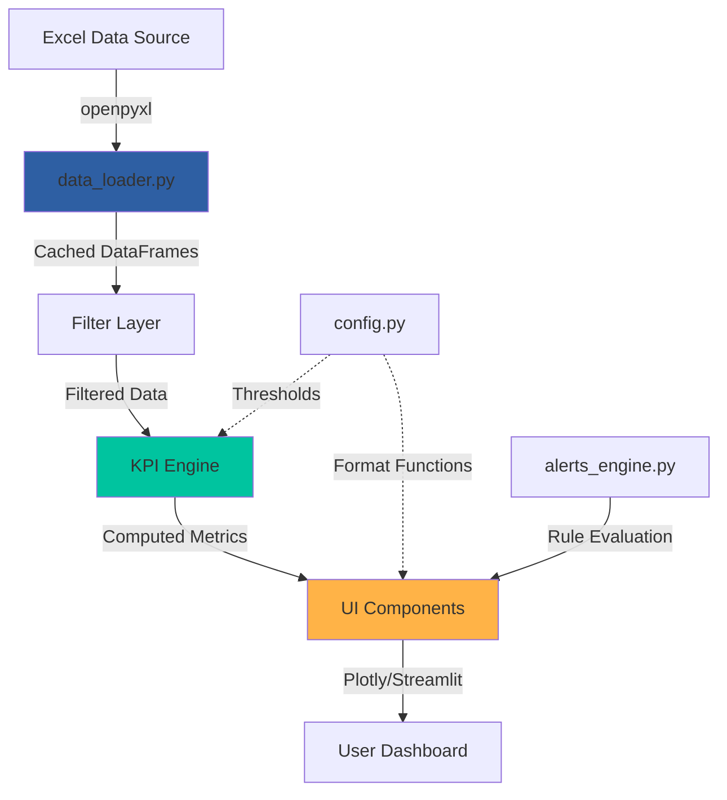

## Architectural Philosophy

Visor KPI Comercial follows a **layered architecture** pattern that enforces clear separation of concerns. The system is built on three fundamental layers:

<CardGroup cols={3}>
  <Card title="Business Logic" icon="brain" color="#1B3A6B">
    Core calculation engines in `src/` handle all KPI computations, data transformations, and business rules independently of the UI.
  </Card>
  <Card title="UI Components" icon="palette" color="#2E5FA3">
    Reusable presentation components in `components/` render data without business logic, enabling consistent styling and behavior.
  </Card>
  <Card title="Page Views" icon="window-restore" color="#00C49F">
    Page modules in `pages/` orchestrate components and business logic to deliver role-specific dashboards.
  </Card>
</CardGroup>

## Data Flow Architecture

The application follows a unidirectional data flow pattern:



### Flow Breakdown

1. **Data Ingestion** (`src/data_loader.py`)
   - Reads Excel workbook with 5 sheets: Ventas, Vendedores, Clientes, Productos, Objetivos
   - Applies type coercion and date parsing
   - Caches with `@st.cache_data(ttl=3600)` for performance
   - Returns dictionary of parsed DataFrames

2. **Data Transformation** (`src/data_loader.py:89-124`)
   - `get_master_df()` joins all entities into denormalized view
   - Calculates derived fields: `margen_neto`, `margen_pct`, period columns
   - Enables fast filtering without repeated joins

3. **Filtering Layer** (`src/data_loader.py:131-178`)
   - `get_filtered_data()` applies user selections: date range, sellers, zones, channels
   - `get_filtered_data_periodo_anterior()` calculates equivalent prior period for comparisons
   - All filters are optional (None = no filter)

4. **KPI Computation** (`src/kpi_engine.py`)
   - Pure functions that accept filtered DataFrames
   - Return dictionaries or DataFrames ready for visualization
   - Examples: `kpi_ventas_periodo()`, `kpi_por_vendedor()`, `kpi_clientes()`

5. **Alerts Engine** (`src/alerts_engine.py`)
   - Evaluates 7 business rules against current data
   - Returns structured DataFrame of active alerts with severity levels
   - Rules include: underperformance, churn risk, opportunities

6. **Presentation Layer** (`components/`)
   - Accepts pre-computed data and renders visualizations
   - No business logic—pure presentation
   - Examples: `render_kpi_card()`, `chart_evolucion_ventas()`, `render_ranking_vendedores()`

## Module Responsibilities

### Core Business Logic (`src/`)

| Module | Responsibility | Key Functions |
|--------|----------------|---------------|
| `data_loader.py` | Data ingestion, caching, filtering | `load_data()`, `get_master_df()`, `get_filtered_data()` |
| `kpi_engine.py` | KPI calculations, metrics aggregation | `kpi_ventas_periodo()`, `kpi_por_vendedor()`, `kpi_clientes()`, `kpi_productos()` |
| `alerts_engine.py` | Business rule evaluation, anomaly detection | `get_alertas_activas()` |
| `pareto.py` | 80/20 analysis, customer segmentation | `calcular_pareto()`, `get_concentracion_pareto()` |
| `reports.py` | Export functionality (PDF, Excel) | Report generation utilities |

### UI Components (`components/`)

| Component | Purpose | Location |
|-----------|---------|----------|
| `kpi_card.py` | Metric cards with deltas and progress bars | `components/kpi_card.py:12-70` |
| `charts.py` | Plotly chart factories with consistent theming | `components/charts.py` (487 lines) |
| `filters.py` | Sidebar filter panel with session state | `components/filters.py:36-213` |
| `rankings.py` | Tabular rankings for sellers/clients/products | `components/rankings.py` |

### Page Views (`pages/` + `app.py`)

| Page | Role | Metrics Focus |
|------|------|---------------|
| `app.py` | Executive summary | High-level KPIs, team performance, top alerts |
| `1_gerencia.py` | Management view | Full seller rankings, zone analysis, heatmaps |
| `2_vendedores.py` | Seller performance | Individual targets, client portfolio, trends |
| `3_clientes.py` | Customer analysis | Pareto classification, churn risk, RFM |
| `4_productos.py` | Product intelligence | Category performance, slow movers, treemaps |
| `5_alertas.py` | Alert center | Filterable alert list, action tracking |

## Configuration & Theming (`config.py`)

Centralizes all system constants and formatting:

```python
COLORS = {
    "primary": "#1B3A6B",
    "success": "#00C49F",  # Green semaphore
    "warning": "#FFB347",  # Amber semaphore
    "danger":  "#E84855",  # Red semaphore
    # ... 15 more color definitions
}

THRESHOLDS = {
    "cumplimiento_ok": 1.00,      # 100% → green
    "cumplimiento_warning": 0.80, # 80%  → amber
    "caida_critica": -0.20,       # -20% vs prior
}
```

**Format functions** (`config.py:67-132`):
- `fmt_moneda(valor)` → `"$1.284.500"` (Argentine locale)
- `fmt_pct(valor)` → `"84.2%"`
- `fmt_delta(valor)` → `"▲ +8.2%"` with color

**Semaphore logic** (`config.py:136-168`):
- `get_color_semaforo(cumplimiento)` → Returns hex color based on threshold
- `get_label_semaforo(cumplimiento)` → Returns `'success'|'warning'|'danger'`

## Caching Strategy

Visor KPI uses Streamlit's caching to minimize Excel I/O:

```python
@st.cache_data(ttl=3600, show_spinner=False)
def load_data() -> dict[str, pd.DataFrame]:
    # Cached for 1 hour
    # Only re-runs if DATA_PATH changes or TTL expires
```

**Benefits:**
- First page load: ~2-3 seconds
- Subsequent interactions: &lt;100ms (cached)
- Shared cache across all user sessions
- Automatic invalidation on file change

## Session State Management

Filters persist across pages using `st.session_state` (`components/filters.py:16-33`):

```python
defaults = {
    "periodo_sel":    "Este mes",
    "fecha_desde":    primer_dia_mes,
    "fecha_hasta":    hoy,
    "vendedores_sel": [],
    "zonas_sel":      [],
    "canales_sel":    [],
}
```

This enables:
- Persistent filter selections when navigating between pages
- Synchronized state across components
- "Clean filters" functionality

## Error Handling Pattern

Robust data validation at the entry point (`app.py:50-56`):

```python
if not check_data_available():
    st.error(
        "⚠️ **No se encontró el archivo de datos.**\n\n"
        "Ejecutá el siguiente comando para generar los datos mock:\n\n"
        "```bash\npython data/mock/generate_mock_data.py\n```"
    )
    st.stop()
```

Empty DataFrame handling in KPI functions:

```python
if df.empty:
    return pd.DataFrame()  # or default dict
```

## Performance Characteristics

| Operation | Typical Time | Optimization |
|-----------|--------------|-------------|
| Excel load (cold) | 1.5-2.5s | `@st.cache_data` caching |
| Excel load (warm) | &lt;10ms | Cache hit |
| Filter application | 50-150ms | Cached master DataFrame |
| KPI calculation | 20-80ms | Vectorized pandas operations |
| Chart rendering | 100-300ms | Plotly client-side rendering |

## Extension Points

### Adding a New KPI

1. Define calculation function in `src/kpi_engine.py`:
   ```python
   def kpi_nueva_metrica(df: pd.DataFrame, ...) -> dict:
       # Pure calculation logic
       return {"valor": ..., "delta": ...}
   ```

2. Call from page view:
   ```python
   kpi_nueva = kpi_nueva_metrica(df, df_ant)
   render_kpi_card("Nueva Métrica", fmt_moneda(kpi_nueva["valor"]))
   ```

### Adding a New Chart Type

1. Create chart factory in `components/charts.py`:
   ```python
   def chart_nueva_viz(df: pd.DataFrame, title: str) -> go.Figure:
       fig = go.Figure()
       # ... build chart
       return _apply_theme(fig, title)
   ```

2. Use in any page:
   ```python
   fig = chart_nueva_viz(df, "Mi Análisis")
   st.plotly_chart(fig, use_container_width=True)
   ```

### Adding a New Alert Rule

1. Append to `ALERT_RULES` in `src/alerts_engine.py:14-71`
2. Implement evaluation logic in `get_alertas_activas()` function
3. Alerts automatically appear in dashboard and alert center

---

## Next Steps

<CardGroup cols={2}>
  <Card title="Project Structure" icon="folder-tree" href="/dev/project-structure">
    Explore the complete directory layout and file purposes
  </Card>
  <Card title="Tech Stack" icon="layer-group" href="/dev/tech-stack">
    Deep dive into dependencies and technology choices
  </Card>
</CardGroup>